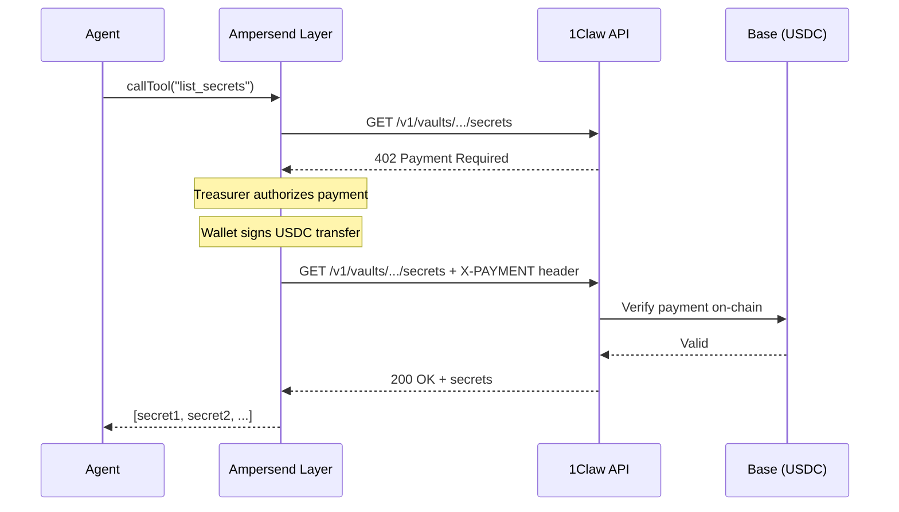

# 1Claw + Ampersend x402 Payments

> **Warning — Not for production use.** This example is for reference and learning only. Review and adapt for your own security requirements before using in production.

**Difficulty: Advanced**

Budget-controlled x402 micropayments for 1Claw API access using the [Ampersend SDK](https://github.com/edgeandnode/ampersend-sdk). When the agent exceeds the free tier, Ampersend handles payment authorization and wallet signing so API calls continue seamlessly.

## Architecture



## Three approaches

| Script                      | Difficulty | Description                                                     |
| --------------------------- | ---------- | --------------------------------------------------------------- |
| `src/mcp-with-payments.ts`  | Easiest    | MCP client with automatic x402. One function call setup.        |
| `src/http-with-payments.ts` | Medium     | Wraps `fetch()` with payment handling. Works with the REST API. |
| `src/custom-treasurer.ts`   | Advanced   | Hybrid billing: checks 1Claw credits first, falls back to x402. |

## Prerequisites

1. A [1Claw account](https://1claw.xyz) with a vault
2. A wallet funded with USDC on Base (use a session key, not your main wallet)
3. Node.js 20+
4. (Optional) [Test USDC from Circle faucet](https://faucet.circle.com) for testing

## Quick start

```bash
cd examples/ampersend-x402
npm install
cp .env.example .env
# Fill in BUYER_PRIVATE_KEY, ONECLAW_API_KEY, ONECLAW_VAULT_ID
```

### MCP client (easiest)

```bash
npm start
```

### HTTP client

```bash
npm run http
```

### Hybrid billing (credits + x402 fallback)

```bash
npm run hybrid
```

## Environment variables

| Variable              | Required  | Description                                     |
| --------------------- | --------- | ----------------------------------------------- |
| `BUYER_PRIVATE_KEY`   | Yes       | Private key for the x402 payment wallet (0x...) |
| `ONECLAW_API_KEY`     | Yes       | Your 1Claw API key (`ocv_...`)                  |
| `ONECLAW_VAULT_ID`    | Yes       | UUID of the vault to operate on                 |
| `ONECLAW_AGENT_ID`    | No        | Agent UUID for agent-level policies             |
| `ONECLAW_AGENT_TOKEN` | Yes (MCP) | Agent JWT for MCP server auth                   |
| `ONECLAW_BASE_URL`    | No        | API URL (default: `https://api.1claw.xyz`)      |

## What you'll see

**`npm start`** (MCP client):

```
=== 1Claw + Ampersend MCP Client ===

Connecting to 1Claw MCP server with x402 payment support...

1. Listing available tools...
   Found 11 tools: list_secrets, get_secret, put_secret, ...

2. Listing secrets (may require payment if over quota)...
   Result: [{ "type": "text", "text": "Found 3 secret(s)..." }]

3. Reading a secret (higher chance of 402 on free tier)...
   Result: [{ "type": "text", "text": "api-keys/stripe: ..." }]

Done. If any calls exceeded your quota, Ampersend handled the
x402 payment automatically using your session key wallet.
```

**`npm run hybrid`** (custom treasurer):

```
=== 1Claw + Ampersend Hybrid Billing ===

1. Checking current credit balance...
   Balance: $5.00 (500 cents)

2. Listing secrets (with hybrid payment if over quota)...
  [treasurer] Payment requested: erc20 for 1000000 units
  [treasurer] 1Claw credit balance: $5.00
  [treasurer] Credits sufficient (>$1.00) — switching overage method to credits
   Status: 200
   Found 3 secret(s)
```

## How it works

### MCP client (`mcp-with-payments.ts`)

`createAmpersendMcpClient()` wraps the MCP protocol transport. Every tool call that returns a 402 is automatically retried with a signed payment. No code changes needed beyond the initial setup.

### HTTP client (`http-with-payments.ts`)

`wrapWithAmpersend()` wraps the standard `fetch()` function. When a response has status 402, it reads the `X-PAYMENT-REQUIRED` header, has the Treasurer authorize the amount, signs with the Wallet, and retries. Works with any HTTP endpoint.

### Custom Treasurer (`custom-treasurer.ts`)

Implements the `X402Treasurer` interface to add business logic before authorizing payments:

1. Checks 1Claw's `/v1/billing/credits/balance` endpoint
2. If credits exceed the threshold, switches the org's overage method to `credits` (no on-chain payment)
3. If credits are depleted, approves the on-chain x402 payment

This hybrid approach minimizes gas costs by preferring off-chain credits when available.

## Wallet safety

- **Use a session key** — never put your main wallet's private key in env vars
- **Fund minimally** — only load enough USDC for testing
- **NaiveTreasurer** approves all payments — use `createAmpersendTreasurer()` in production for spend limits
- The `HybridTreasurer` in `custom-treasurer.ts` shows how to add custom authorization logic

## Next steps

- [LangChain example](../langchain-agent/) — Simpler agent pattern
- [FastMCP example](../fastmcp-tool-server/) — Build a custom MCP server
- [Google A2A example](../google-a2a/) — Agent-to-Agent protocol
- [Ampersend SDK docs](https://github.com/edgeandnode/ampersend-sdk)
- [x402 specification](https://github.com/coinbase/x402)
- [1Claw pricing](https://1claw.xyz/pricing) — Subscription tiers and credit pricing
