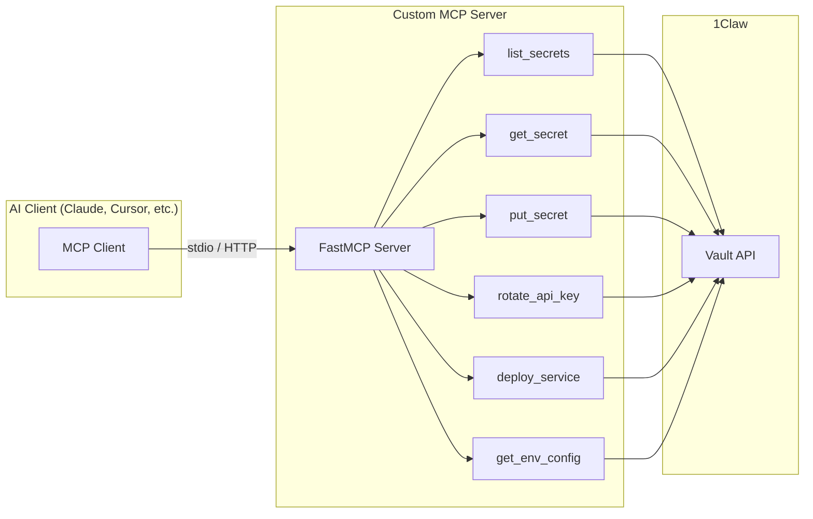

# 1Claw + FastMCP Tool Server

> **Warning — Not for production use.** This example is for reference and learning only. Review and adapt for your own security requirements before using in production.

**Difficulty: Intermediate**

A custom MCP server built with [FastMCP](https://github.com/punkpeye/fastmcp) that composes 1Claw SDK operations into higher-level, domain-specific tools. The server exposes business-logic tools like `rotate_api_key`, `deploy_service`, and `get_env_config` alongside standard vault operations.

## Architecture



## Tools

| Tool             | Description                                               |
| ---------------- | --------------------------------------------------------- |
| `list_secrets`   | List all secrets in the vault (paths, types, versions)    |
| `get_secret`     | Fetch a decrypted secret value                            |
| `put_secret`     | Store or update a secret                                  |
| `rotate_api_key` | Fetch current key, "regenerate" it, store the new value   |
| `get_env_config` | Parse an `env_bundle` secret into a JSON key-value object |
| `deploy_service` | Fetch a deploy key, simulate deployment, store the log    |

## Prerequisites

1. A [1Claw account](https://1claw.xyz) with a vault and agent
2. An agent JWT (from `POST /v1/auth/agent-token`)
3. Node.js 20+

## Quick start

### Run as stdio (default)

```bash
cd examples/fastmcp-tool-server
npm install
cp .env.example .env
# Fill in ONECLAW_AGENT_TOKEN and ONECLAW_VAULT_ID
npm start
```

### Add to Claude Desktop / Cursor

Copy `mcp-config.json` into your MCP settings, replacing the env var placeholders:

```json
{
    "mcpServers": {
        "1claw-devops": {
            "command": "npx",
            "args": ["tsx", "src/server.ts"],
            "cwd": "/path/to/examples/fastmcp-tool-server",
            "env": {
                "ONECLAW_AGENT_TOKEN": "your-jwt",
                "ONECLAW_VAULT_ID": "your-uuid"
            }
        }
    }
}
```

### Run as HTTP streaming

```bash
MCP_TRANSPORT=httpStream PORT=3001 npm start
# Server listens at http://localhost:3001
```

## Environment variables

| Variable              | Required | Description                                    |
| --------------------- | -------- | ---------------------------------------------- |
| `ONECLAW_AGENT_TOKEN` | Yes      | Agent JWT for 1Claw API auth                   |
| `ONECLAW_VAULT_ID`    | Yes      | UUID of the vault to operate on                |
| `ONECLAW_BASE_URL`    | No       | API URL (default: `https://api.1claw.xyz`)     |
| `MCP_TRANSPORT`       | No       | `stdio` (default) or `httpStream`              |
| `PORT`                | No       | HTTP port for streaming mode (default: `3001`) |

## How it works

1. **FastMCP** creates an MCP-compliant server with tools, resources, and prompts.
2. **Standard tools** (`list_secrets`, `get_secret`, `put_secret`) are thin pass-throughs to the 1Claw SDK.
3. **Domain tools** compose multiple SDK calls. For example, `rotate_api_key` reads the current value, generates a new one, and writes it back — all as a single tool invocation.
4. **Resource** (`vault://info`) provides a read-only snapshot of vault contents.
5. The server runs over **stdio** (for Claude Desktop / Cursor) or **HTTP streaming** (for remote clients).

## Next steps

- [LangChain example](../langchain-agent/) — Connect LangChain to this server
- [Google A2A example](../google-a2a/) — Agent-to-Agent with 1Claw
- [1Claw Docs](https://docs.1claw.xyz) — Full API reference
