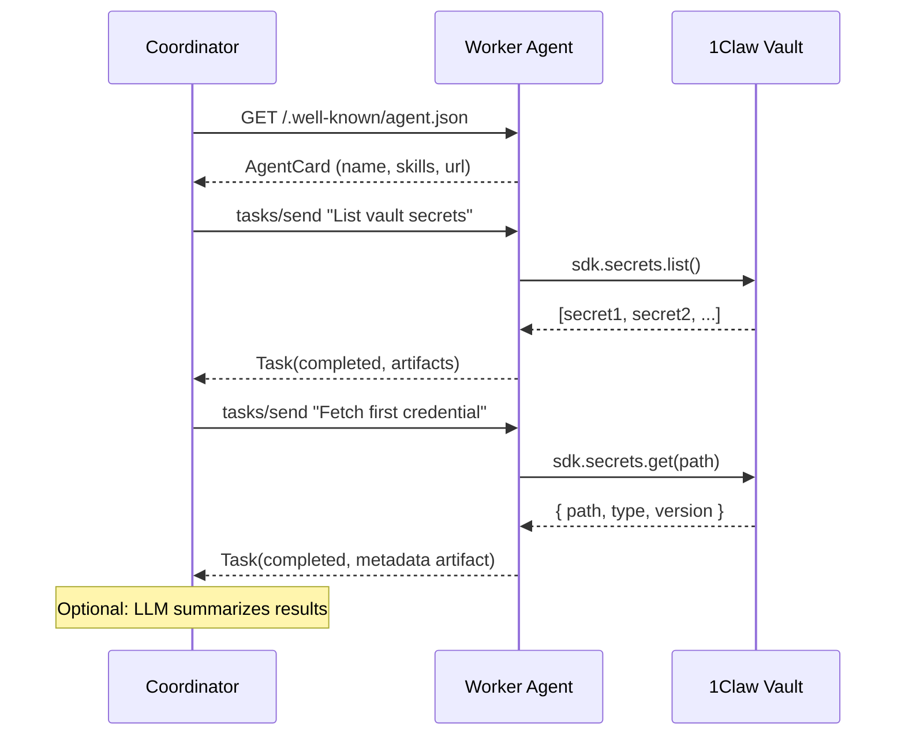

# 1Claw + Google Agent-to-Agent (A2A)

> **Warning — Not for production use.** This example is for reference and learning only. Review and adapt for your own security requirements before using in production.

**Difficulty: Intermediate**

Two agents communicating via Google's [Agent-to-Agent (A2A) protocol](https://google.github.io/A2A/). This repo includes:

1. **Vault demo** — Coordinator + worker; the worker uses 1Claw to list/fetch vault secrets.
2. **ECDH demo** — Two agents (Alice & Bob) with different public keys exchange ECDH-encrypted, ECDSA-signed messages over A2A. Keys can be **stored in 1Claw** (two vaults/accounts) or generated in-memory.

## ECDH signed-message demo (recommended)

Two agents, each with a P-256 key pair (ECDH for encryption, ECDSA for signing), exchange a message: Alice encrypts and signs, Bob decrypts and verifies. Showcases A2A as the transport for agent-to-agent crypto.

### Option A: In-memory keys (no 1Claw)

```bash
cd examples/google-a2a
npm install
npm run ecdh
```

### Option B: Keys in 1Claw (two accounts)

Use two 1Claw vaults (or two accounts). Each agent loads its private keys from its vault at startup — more compelling for production-like identity and secret management.

1. **Create two vaults** (e.g. one per account or two vaults in one org).
2. **Bootstrap keys** into both vaults (generates ECDH + ECDSA key pairs and stores them):

   ```bash
   export ONECLAW_ALICE_VAULT_ID=<alice-vault-uuid>
   export ONECLAW_ALICE_API_KEY=<alice-api-key>
   export ONECLAW_BOB_VAULT_ID=<bob-vault-uuid>
   export ONECLAW_BOB_API_KEY=<bob-api-key>
   npm run ecdh:bootstrap
   ```

   This writes `keys/ecdh` and `keys/signing` (base64 private key material) into each vault.

3. **Run the demo** with the same env vars (or put them in `.env`). The start script maps Alice/Bob vault and API key to each worker:

   ```bash
   npm run ecdh
   ```

Or run workers manually: Terminal 1 `ONECLAW_VAULT_ID=<alice-vault> ONECLAW_API_KEY=<alice-key> npm run ecdh:alice`, Terminal 2 with Bob's vars, Terminal 3 `npm run ecdh:coordinator`.

| File                          | Description |
| ----------------------------- | ----------- |
| `src/ecdh-crypto.ts`          | ECDH shared secret, AES-GCM, ECDSA sign/verify; load keys from stored privates |
| `src/ecdh-worker.ts`         | Single worker (Alice or Bob); loads keys from 1Claw if `ONECLAW_VAULT_ID` + `ONECLAW_API_KEY` set |
| `src/ecdh-coordinator.ts`     | Discovers both agents, gets public keys, orchestrates one send/receive |
| `src/start-ecdh-demo.ts`      | Starts Alice (4100), Bob (4101), then coordinator; maps ALICE/BOB env to each worker |
| `scripts/bootstrap-ecdh-keys.ts` | Generates key pairs and stores them in two vaults (run once per two-account setup) |
| `scripts/cleanup-ecdh-keys.ts`   | Deletes `keys/ecdh` and `keys/signing` from both vaults |
| `scripts/test-ecdh-with-1claw.ts` | End-to-end test: bootstrap → demo → cleanup |

## Vault demo architecture



## Files

| File                     | Description                                                                        |
| ------------------------ | ---------------------------------------------------------------------------------- |
| `src/a2a-types.ts`       | Minimal A2A protocol type definitions (AgentCard, Task, Message, Artifact)         |
| `src/worker-agent.ts`   | Vault demo: A2A server using 1Claw SDK for list/fetch secrets                       |
| `src/coordinator.ts`    | Vault demo: discovers worker, sends list/fetch tasks                                |
| `src/start-all.ts`      | Starts vault demo worker + coordinator                                             |
| `src/ecdh-crypto.ts`    | ECDH demo: P-256 key agreement, AES-GCM, ECDSA sign/verify                         |
| `src/ecdh-worker.ts`    | ECDH demo: one agent (Alice or Bob); skills: get key, send message, receive message |
| `src/ecdh-coordinator.ts` | ECDH demo: discovers Alice & Bob, orchestrates one encrypted signed message        |
| `src/start-ecdh-demo.ts`  | Starts Alice, Bob, then ECDH coordinator                                             |
| `scripts/bootstrap-ecdh-keys.ts` | ECDH + 1Claw: generates keys and stores in two vaults                              |
| `scripts/cleanup-ecdh-keys.ts`   | ECDH + 1Claw: removes demo secrets from both vaults                                |
| `scripts/test-ecdh-with-1claw.ts` | ECDH + 1Claw: bootstrap → run demo → cleanup (full test)                           |

## Prerequisites

1. A [1Claw account](https://1claw.xyz) with a vault containing at least one secret
2. Node.js 20+
3. (Optional) OpenAI API key for the coordinator's LLM reasoning step

## Quick start

### Run both together

```bash
cd examples/google-a2a
npm install
cp .env.example .env
# Fill in ONECLAW_API_KEY, ONECLAW_VAULT_ID (and optionally ONECLAW_AGENT_ID for agent-level policies)
npm start
```

You can also run with another example's env (e.g. same vault and API key):

```bash
npx tsx --env-file=../ampersend-x402/.env src/start-all.ts
```

### Run separately (for debugging)

**Terminal 1 — Worker:**

```bash
npm run worker
# Worker listens at http://localhost:4100
```

**Terminal 2 — Coordinator:**

```bash
npm run coordinator
```

## Environment variables

| Variable           | Required | Description                                                                 |
| ------------------ | -------- | --------------------------------------------------------------------------- |
| `ONECLAW_API_KEY`  | Yes      | 1Claw API key (user or agent key) for vault access                          |
| `ONECLAW_VAULT_ID` | Yes      | UUID of the vault the worker reads from                                     |
| `ONECLAW_AGENT_ID` | No       | Agent UUID; when set, worker uses agent token for agent-level policies     |
| `OPENAI_API_KEY`   | No       | Enables LLM summary in the coordinator                                      |
| `WORKER_PORT`      | No       | Worker port (default: `4100`)                                               |
| `WORKER_URL`       | No       | Worker URL for coordinator (default: `http://localhost:4100`)               |
| `ONECLAW_BASE_URL` | No       | API URL (default: `https://api.1claw.xyz`)                                  |

## What you'll see

```
Starting worker agent...
[worker] 1Claw Vault Worker agent listening on port 4100
[worker] Agent Card: http://localhost:4100/.well-known/agent.json

Starting coordinator...

[coordinator] Starting A2A coordinator...
[coordinator] Discovering worker at http://localhost:4100...
[coordinator] Found: "1Claw Vault Worker" — A worker agent that retrieves...
[coordinator] Skills: Fetch Secret, List Vault Secrets

[coordinator] Sending task: "List all available secrets in the vault"
[worker] Task <id>: "List all available secrets in the vault"
[coordinator] Task <id> — state: completed
[coordinator] Agent says: Task completed with 1 artifact(s).

[coordinator] Received 1 artifact(s):
  - secret-list:
    Found N secret(s):
    - <path> (<type>, v<n>)
    ...

[coordinator] Sending follow-up: fetch a specific credential...
[coordinator] Follow-up state: completed | failed
[coordinator] Done.
```

The list-secrets task always completes with an artifact. The follow-up (fetch first credential) may complete or fail depending on vault contents and task wording.

## How it works

1. **Agent Card discovery** — The coordinator fetches `/.well-known/agent.json` to learn the worker's name, capabilities, and skills (per A2A spec).
2. **JSON-RPC tasks** — The coordinator sends tasks using the `tasks/send` method. The worker processes them synchronously and returns results with artifacts.
3. **1Claw integration** — The worker uses `@1claw/sdk` to list and fetch secrets. Credential values are never included in A2A artifacts — only metadata (path, type, version, value length).
4. **LLM reasoning** — If `OPENAI_API_KEY` is set, the coordinator uses GPT-4o-mini to summarize the worker's response.

**What you'll see (ECDH demo):** Coordinator discovers Alice and Bob, gets their public keys from Agent Cards, asks Alice to send an encrypted+signed message to Bob, then asks Bob to decrypt and verify. Final line: Bob's decrypted plaintext and a success note.

## Next steps

- [LangChain example](../langchain-agent/) — Simpler agent pattern
- [FastMCP example](../fastmcp-tool-server/) — Build a custom MCP server
- [Ampersend x402 example](../ampersend-x402/) — Add payment controls
- [A2A Specification](https://google.github.io/A2A/) — Full protocol docs
