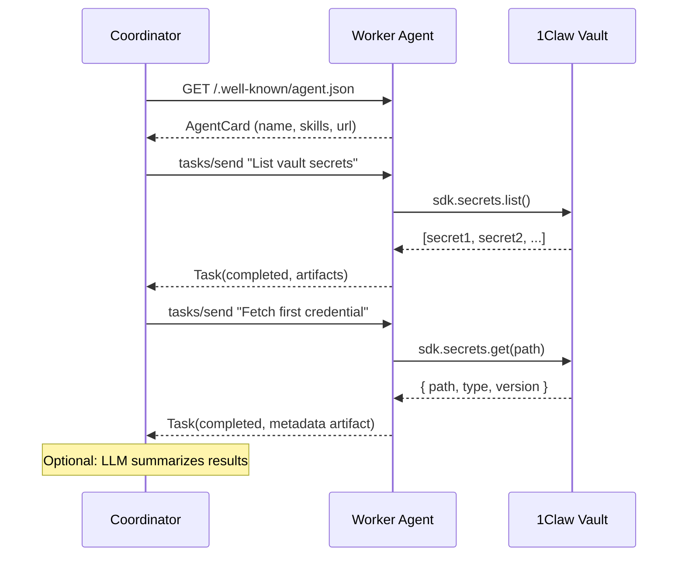

# 1Claw + Google Agent-to-Agent (A2A)

> **Warning — Not for production use.** This example is for reference and learning only. Review and adapt for your own security requirements before using in production.

**Difficulty: Intermediate**

Two agents communicating via Google's [Agent-to-Agent (A2A) protocol](https://google.github.io/A2A/), with 1Claw providing the secure secret layer. A coordinator agent discovers a worker agent, sends it a task that requires credentials, and the worker retrieves the credentials from a 1Claw vault.

## Architecture



## Files

| File                  | Description                                                                        |
| --------------------- | ---------------------------------------------------------------------------------- |
| `src/a2a-types.ts`    | Minimal A2A protocol type definitions (AgentCard, Task, Message, Artifact)         |
| `src/worker-agent.ts` | Express server implementing the A2A protocol. Uses 1Claw SDK for credential access |
| `src/coordinator.ts`  | Discovers the worker via Agent Card, sends tasks, processes results                |
| `src/start-all.ts`    | Convenience script that starts both processes for local testing                    |

## Prerequisites

1. A [1Claw account](https://1claw.xyz) with a vault containing at least one secret
2. Node.js 20+
3. (Optional) OpenAI API key for the coordinator's LLM reasoning step

## Quick start

### Run both together

```bash
cd examples/google-a2a
npm install
cp .env.example .env
# Fill in ONECLAW_API_KEY, ONECLAW_VAULT_ID
npm start
```

### Run separately (for debugging)

**Terminal 1 — Worker:**

```bash
npm run worker
# Worker listens at http://localhost:4100
```

**Terminal 2 — Coordinator:**

```bash
npm run coordinator
```

## Environment variables

| Variable           | Required | Description                                                   |
| ------------------ | -------- | ------------------------------------------------------------- |
| `ONECLAW_API_KEY`  | Yes      | 1Claw API key for vault access                                |
| `ONECLAW_VAULT_ID` | Yes      | UUID of the vault to read from                                |
| `ONECLAW_AGENT_ID` | No       | Agent UUID for agent-level policies                           |
| `OPENAI_API_KEY`   | No       | Enables LLM summary in the coordinator                        |
| `WORKER_PORT`      | No       | Worker port (default: `4100`)                                 |
| `WORKER_URL`       | No       | Worker URL for coordinator (default: `http://localhost:4100`) |
| `ONECLAW_BASE_URL` | No       | API URL (default: `https://api.1claw.xyz`)                    |

## What you'll see

```
Starting worker agent...
[worker] 1Claw Vault Worker agent listening on port 4100
[worker] Agent Card: http://localhost:4100/.well-known/agent.json

Starting coordinator...

[coordinator] Starting A2A coordinator...
[coordinator] Discovering worker at http://localhost:4100...
[coordinator] Found: "1Claw Vault Worker" — A worker agent that retrieves...
[coordinator] Skills: Fetch Secret, List Vault Secrets

[coordinator] Sending task: "List all available secrets in the vault"
[worker] Task abc-123: "List all available secrets in the vault"
[coordinator] Task abc-123 — state: completed
[coordinator] Agent says: Task completed with 1 artifact(s).

[coordinator] Received 1 artifact(s):
  - secret-list:
    Found 3 secret(s):
    - api-keys/stripe (api_key, v1)
    - database/prod (password, v2)
    - deploy-keys/github (private_key, v1)

[coordinator] Sending follow-up: fetch a specific credential...
[coordinator] Follow-up state: completed
[coordinator] Secret metadata: { path: "api-keys/stripe", type: "api_key", version: 1, ... }

[coordinator] Done.
```

## How it works

1. **Agent Card discovery** — The coordinator fetches `/.well-known/agent.json` to learn the worker's name, capabilities, and skills (per A2A spec).
2. **JSON-RPC tasks** — The coordinator sends tasks using the `tasks/send` method. The worker processes them synchronously and returns results with artifacts.
3. **1Claw integration** — The worker uses `@1claw/sdk` to list and fetch secrets. Credential values are never included in A2A artifacts — only metadata (path, type, version, value length).
4. **LLM reasoning** — If `OPENAI_API_KEY` is set, the coordinator uses GPT-4o-mini to summarize the worker's response.

## Next steps

- [LangChain example](../langchain-agent/) — Simpler agent pattern
- [FastMCP example](../fastmcp-tool-server/) — Build a custom MCP server
- [Ampersend x402 example](../ampersend-x402/) — Add payment controls
- [A2A Specification](https://google.github.io/A2A/) — Full protocol docs
