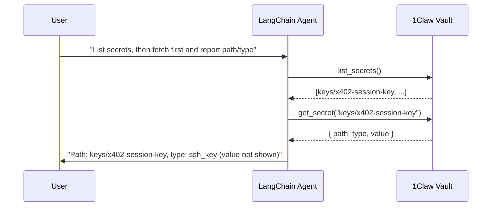

# 1Claw + LangChain Agent

> **Warning — Not for production use.** This example is for reference and learning only. Review and adapt for your own security requirements before using in production.

**Difficulty: Beginner**

LangChain agent that uses 1Claw to list vault secrets and retrieve the first one (reporting path and type only, never the value). Demonstrates just-in-time secret access: the agent calls 1Claw when it needs to list or fetch.

## Architecture



## Two approaches

| Script                | What it does                                                                                        |
| --------------------- | --------------------------------------------------------------------------------------------------- |
| `src/tool-calling.ts` | Defines custom LangChain tools that wrap the `@1claw/sdk`. You control which tools the agent has.   |
| `src/mcp-client.ts`   | Connects LangChain to the hosted 1Claw MCP server. The agent gets all 11 vault tools automatically. |

## Prerequisites

1. A [1Claw account](https://1claw.xyz) with a vault
2. One LLM key: OpenAI (`OPENAI_API_KEY`) or Gemini free tier (`GOOGLE_API_KEY` from [aistudio.google.com/apikey](https://aistudio.google.com/apikey))
3. Node.js 20+

## Quick start

1. **Have at least one secret in your vault** (any path). The agent will list secrets, then fetch the first one and report its path and type (it will not display the secret value).

2. **Run the agent:**

```bash
cd examples/langchain-agent
npm install
# If you see peer dependency conflicts, use: npm install --legacy-peer-deps
cp .env.example .env
# Fill in ONECLAW_API_KEY, ONECLAW_VAULT_ID, and one of OPENAI_API_KEY or GOOGLE_API_KEY
npm start          # Custom tool calling (lists vault, fetches first secret, reports path/type)
npm run mcp        # MCP client approach
```

You can reuse another example's 1Claw env and only add an LLM key:

```bash
# With OpenAI
OPENAI_API_KEY=sk-... npx tsx --env-file=../ampersend-x402/.env src/tool-calling.ts

# With Gemini free tier (get key at https://aistudio.google.com/apikey)
GOOGLE_API_KEY=... npx tsx --env-file=../ampersend-x402/.env src/tool-calling.ts
```

## Environment variables

| Variable              | Required           | Description                                |
| --------------------- | ------------------ | ------------------------------------------ |
| `OPENAI_API_KEY`      | One required       | OpenAI API key for the LLM                 |
| `GOOGLE_API_KEY`      | One required       | Gemini free tier (get at [aistudio.google.com/apikey](https://aistudio.google.com/apikey)) |
| `ONECLAW_API_KEY`     | Yes (tool-calling) | Your 1Claw API key (`ocv_...`)             |
| `ONECLAW_VAULT_ID`    | Yes                | UUID of the vault to read from             |
| `ONECLAW_AGENT_ID`    | No                 | Agent UUID (omit to auth as human)         |
| `ONECLAW_AGENT_TOKEN` | Yes (mcp)          | Agent JWT for MCP server auth              |
| `ONECLAW_BASE_URL`    | No                 | API URL (default: `https://api.1claw.xyz`) |

## What you'll see

**`npm start`** (tool-calling):

```
=== 1Claw + LangChain Agent ===

LLM: Gemini (GOOGLE_API_KEY)

Asking: list vault secrets, then fetch the first secret and report its path and type (not the value).

  Invoking: list_vault_secrets
  Found 1 secret(s): keys/x402-session-key (ssh_key, v3)

  Invoking: get_secret with { path: "keys/x402-session-key" }

--- Agent Response ---
I listed your vault and fetched the first secret. Path: keys/x402-session-key, type: ssh_key. I'm not displaying the value.
```

## How it works

1. **1Claw SDK** — The agent uses `client.secrets.list()` and `client.secrets.get()` via two LangChain tools.
2. **Tools** — `list_vault_secrets` (no args) and `get_secret(path)` wrap the SDK; the LLM chooses when to call them.
3. **Flow** — The agent lists secrets, then fetches the first secret in the list and reports only its path and type (never the value).

## Next steps

- [1Claw Docs](https://docs.1claw.xyz) — Full API reference
- [FastMCP example](../fastmcp-tool-server/) — Build a custom MCP server with 1Claw
- [Ampersend x402 example](../ampersend-x402/) — Add payment controls
