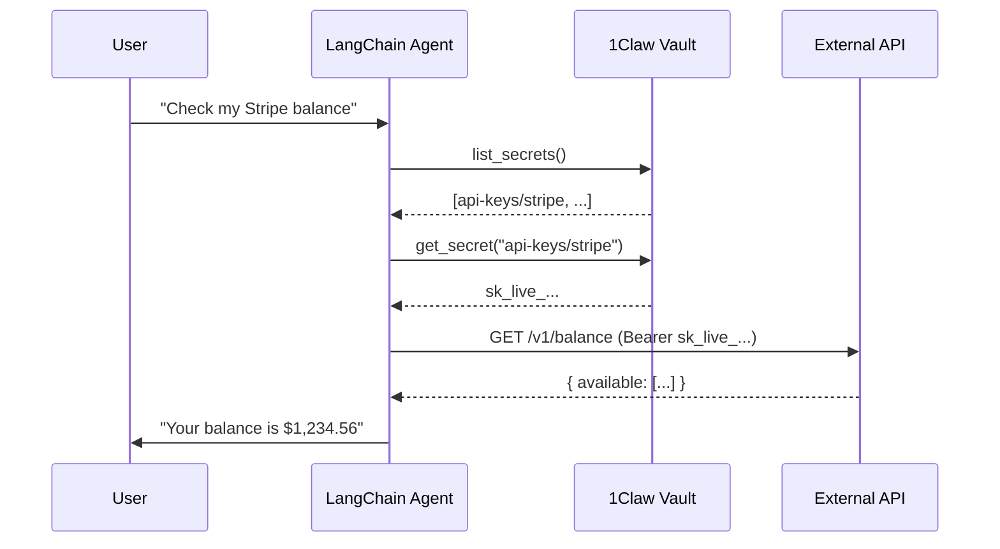

# 1Claw + LangChain Agent

> **Warning — Not for production use.** This example is for reference and learning only. Review and adapt for your own security requirements before using in production.

**Difficulty: Beginner**

LangChain agent that fetches API keys from a 1Claw vault at runtime, then uses them to call external services. Demonstrates the core "just-in-time secret access" pattern for AI agents.

## Architecture



## Two approaches

| Script                | What it does                                                                                        |
| --------------------- | --------------------------------------------------------------------------------------------------- |
| `src/tool-calling.ts` | Defines custom LangChain tools that wrap the `@1claw/sdk`. You control which tools the agent has.   |
| `src/mcp-client.ts`   | Connects LangChain to the hosted 1Claw MCP server. The agent gets all 11 vault tools automatically. |

## Prerequisites

1. A [1Claw account](https://1claw.xyz) with at least one vault and one stored secret
2. An OpenAI API key
3. Node.js 20+

## Quick start

```bash
cd examples/langchain-agent
npm install
cp .env.example .env
# Fill in your keys in .env
npm start          # Custom tool calling
npm run mcp        # MCP client approach
```

## Environment variables

| Variable              | Required           | Description                                |
| --------------------- | ------------------ | ------------------------------------------ |
| `OPENAI_API_KEY`      | Yes                | OpenAI API key for the LLM                 |
| `ONECLAW_API_KEY`     | Yes (tool-calling) | Your 1Claw API key (`ocv_...`)             |
| `ONECLAW_VAULT_ID`    | Yes                | UUID of the vault to read from             |
| `ONECLAW_AGENT_ID`    | No                 | Agent UUID (omit to auth as human)         |
| `ONECLAW_AGENT_TOKEN` | Yes (mcp)          | Agent JWT for MCP server auth              |
| `ONECLAW_BASE_URL`    | No                 | API URL (default: `https://api.1claw.xyz`) |

## What you'll see

**`npm start`** (tool-calling):

```
=== 1Claw + LangChain Agent ===

Asking: 'What secrets are in my vault and what is my Stripe balance?'

> Entering chain...
  Invoking: list_vault_secrets
  Found 2 secret(s):
  api-keys/stripe (api_key, v1)
  api-keys/openai (api_key, v1)

  Invoking: get_secret with { path: "api-keys/stripe" }
  Invoking: call_stripe_api with { api_key: "sk_live_..." }

--- Agent Response ---
Your vault contains 2 secrets. I used the Stripe API key to check
your balance: $1,234.56 available across 1 currency (USD).
```

## How it works

1. **`createClient()`** — The 1Claw SDK auto-authenticates by exchanging the API key for a JWT.
2. **Custom tools** — `list_vault_secrets` and `get_secret` are thin wrappers around `client.secrets.list()` and `client.secrets.get()`.
3. **Agent loop** — LangChain's `AgentExecutor` invokes tools as the LLM decides, passing results back into the conversation.
4. **Secret lifecycle** — The secret value is fetched, used in the Stripe API call, and never stored or echoed.

## Next steps

- [1Claw Docs](https://docs.1claw.xyz) — Full API reference
- [FastMCP example](../fastmcp-tool-server/) — Build a custom MCP server with 1Claw
- [Ampersend x402 example](../ampersend-x402/) — Add payment controls
